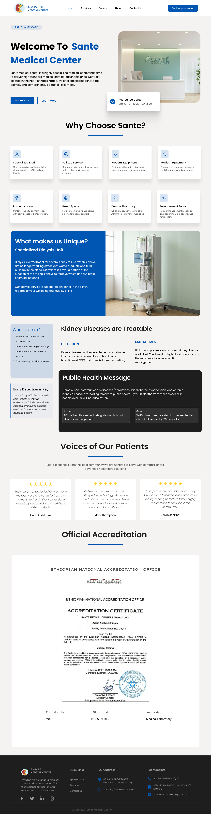
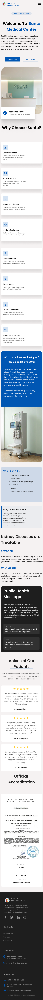
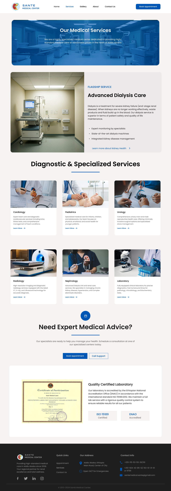
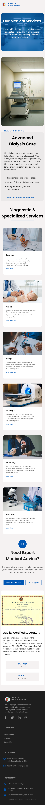
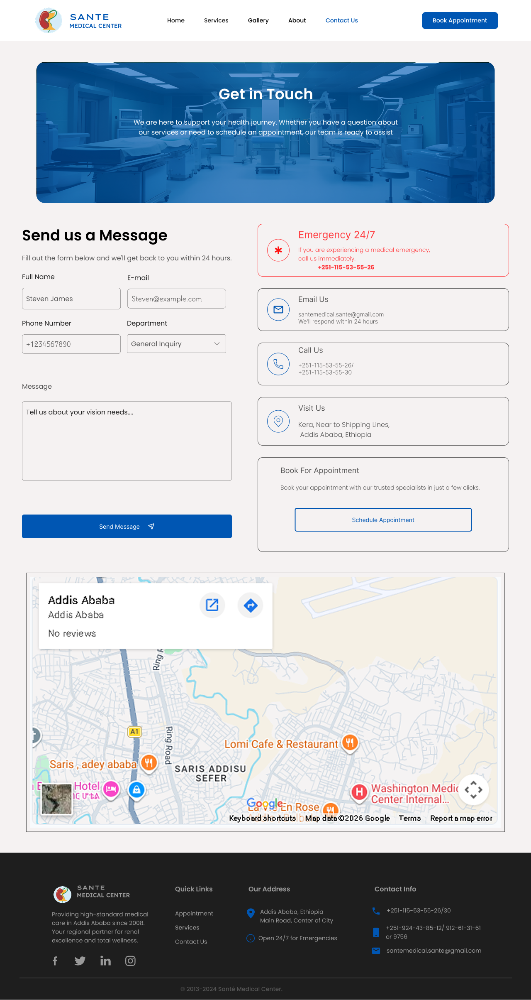
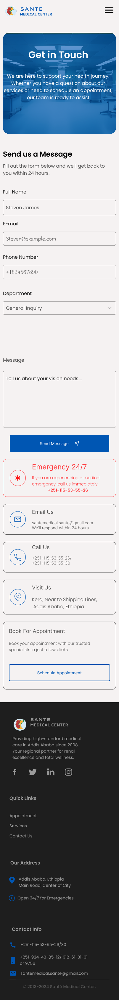

# Sante Medical Center – UI/UX Case Study
UI/UX Design Task 1 – Sante Medical Center – Website Redesign

 ###  Project Overview

This project focuses on redesigning the Sante Medical Center website to improve clarity, user experience, and lead conversion.
The original website functioned mainly as an informational page but lacked a structured system to guide users toward taking action.
The goal of the redesign is to create a high-conversion, user-centered healthcare website that builds trust and encourages appointment bookings.

### 1. Target Users
The primary target users are patients looking for reliable and accessible medical services. 
This includes first-time visitors, returning patients, and individuals seeking specific treatments or consultations.

### 2. Layout Structure
The website is structured to guide users through a clear journey:
- The homepage builds trust and presents key services.
- The service detail page provides detailed information about treatments.
- The contact page makes it easy for users to book appointments or make inquiries.

The layout follows a logical hierarchy from introduction to action.

### 3. UX Decisions
The design focuses on clarity, simplicity, and accessibility.
Clear navigation, readable typography, proper spacing, and consistent call-to-action buttons improve usability.
The interface is designed to be responsive and user-friendly on both desktop and mobile devices.

### 4. How the Design Improves Conversions
The primary call-to-action ("Book Appointment") is placed prominently above the fold to encourage immediate action.
Trust elements such as service descriptions and structured content reduce user hesitation.
The simple contact form minimizes friction and makes it easier for users to complete their booking.

  ## 🖼️ Design Screenshots

###  Home Page

<table>
  <tr>
    <td valign="top">
      
    </td>
    <td valign="top">
      
    </td>
  </tr>
 </table>
 
###  Service Page
 <table>
 <tr>
    <td valign="top">
      
    </td>
    <td valign="top">
      
    </td>
  </tr> </table>
  
###  Contact Page
   <table>
 <tr>
    <td valign="top">
      
    </td>
    <td valign="top">
      
    </td>
  </tr>
</table>

 ## 🖼️ Design Tool
 ###  Figma 
 

## 🔗 Figma Design File

View the full interactive design here:

[Open Figma File](https://www.figma.com/design/8fj8H91T012xhC62EkjO2a/redesign-sante-medical-center?node-id=0-1&t=lsXEAfe6ygKHMB9K-1)
